<p align="center">
  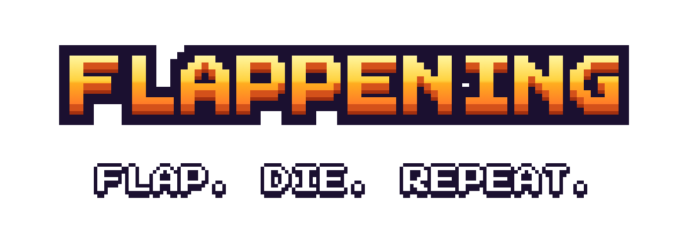
</p>

<p align="center">
  <b>Pick a meme. Pick a world. Flap. Die. Repeat.</b><br>
  A pixel flyer for PC and phone — 10 meme flyers with perks, 4 worlds, coins, power-ups and a leaderboard.
</p>

<p align="center">
  <a href="https://mywestlord.github.io/flappening/"><b>▶ PLAY NOW</b></a>
</p>

<p align="center">
  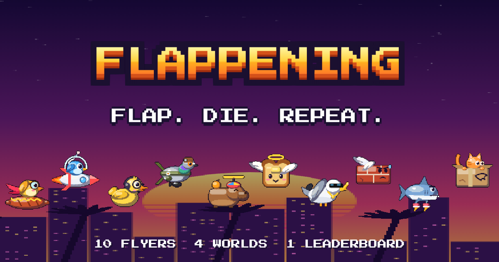
</p>

## Screens

| Menu | Claude Code | To The Moon | Wasted City |
|:---:|:---:|:---:|:---:|
| 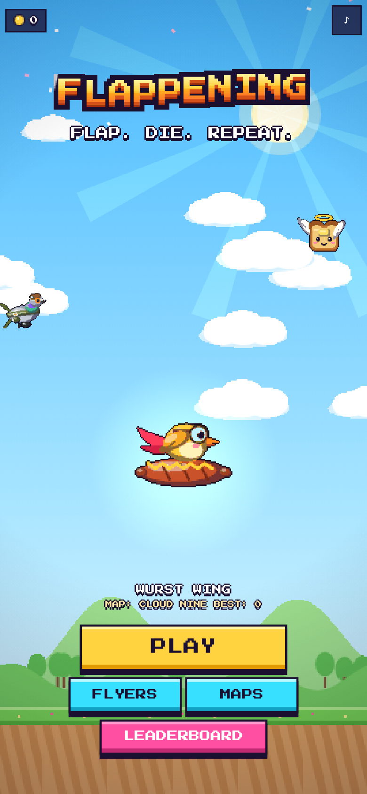 | 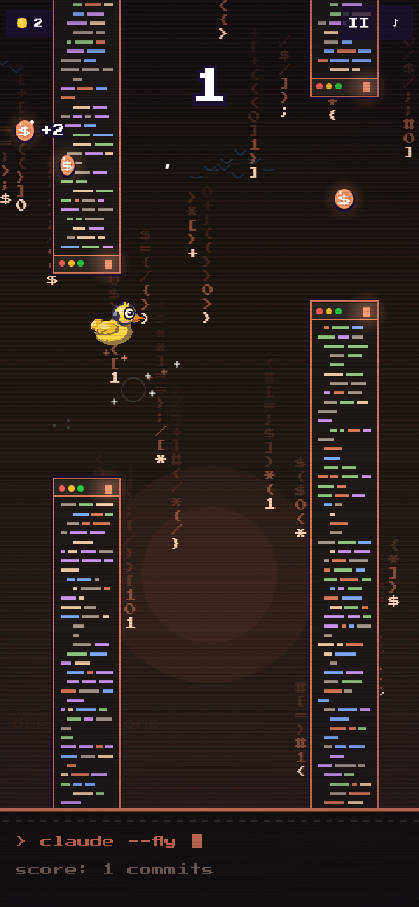 | 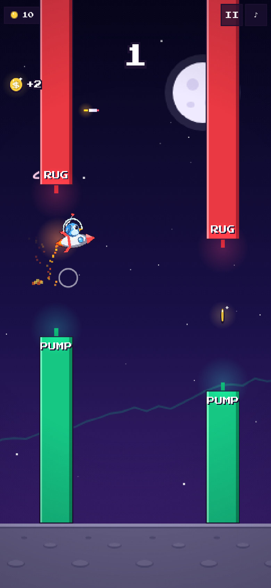 | 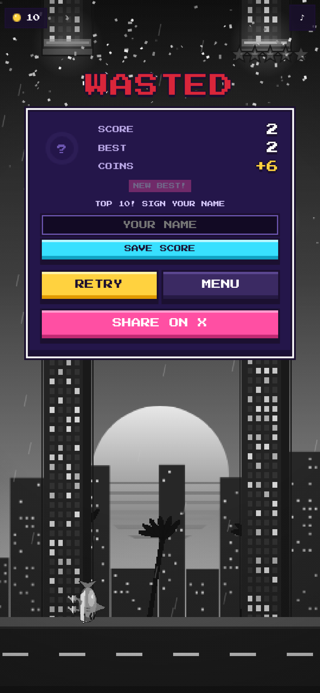 |

| Flyers | Worlds | Cloud Nine | Neon run |
|:---:|:---:|:---:|:---:|
| 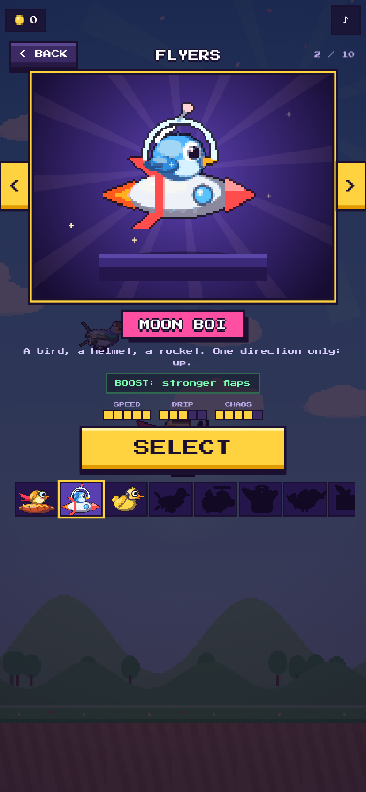 | 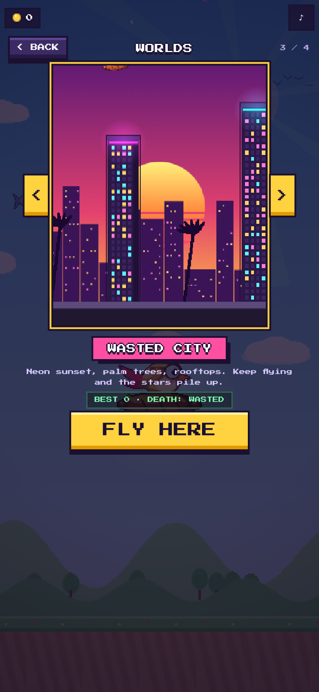 | 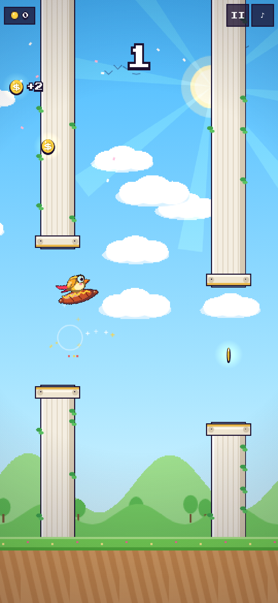 | 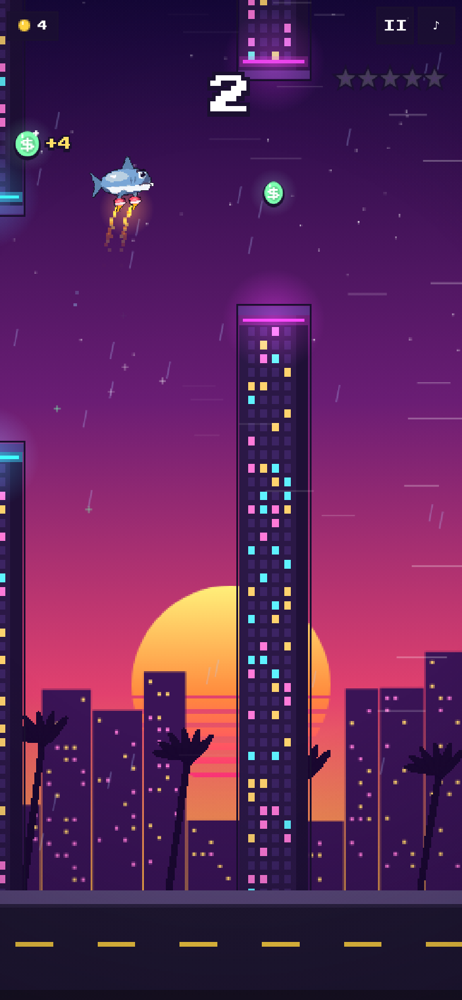 |

## Flyers

Every flyer is hand-built pixel art with cel shading, a 6-frame flap, blinking eyes, its own flap sound, its own particles and its own **perk**.

| | Flyer | Perk | How to get |
|:---:|---|---|---|
| 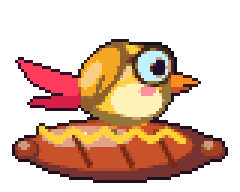 | **Wurst Wing** — a bird on a sausage, goggles and a scarf | **SNACK**: +1 coin every 5 points | free |
| 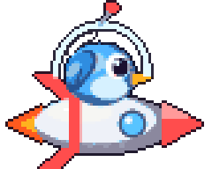 | **Moon Boi** — a bird in a space helmet riding a rocket | **BOOST**: stronger flaps, flame trail | free |
| 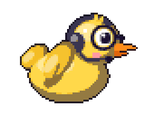 | **Debug Duck** — rubber duck with a headset and glasses | **RUBBER**: bounces off the ground once | free |
| 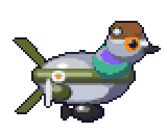 | **Pigeonardo Bombardini** — half pigeon, half bomber | **WAR CHEST**: coins worth x2, drops a bomb every 10 | 30 coins |
| 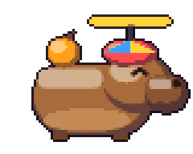 | **Capy Copter** — capybara, yuzu, propeller hat | **CHILL**: world moves 10% slower | 60 coins |
| 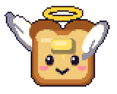 | **Toastito** — holy toast with a halo | **BLESSED**: wider PERFECT zone | 100 coins |
| 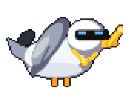 | **Chad Gull** — shades, gold chain, a stolen fry | **THIEF**: pulls coins from far away | 150 coins |
| 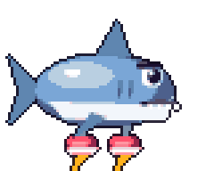 | **Sharko Turbini** — a shark in jet sneakers | **TURBO**: 15% faster, coins x2 | 200 coins |
| 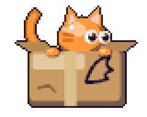 | **Cardboard Cat** — drew wings on a box, it worked | **NINE LIVES**: survives the first hit | 250 coins |
| 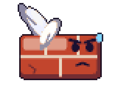 | **Flying Brick** — physics said no | **HEAVY**: falls faster, +1 coin every pass | score 25 anywhere |

## Worlds

| World | Obstacles | Ambient | Death |
|---|---|---|---|
| **Cloud Nine** | marble columns with ivy | sun rays, bird flocks, petals | stars spin around your head — `OUCH!` |
| **Claude Code** | stacked terminal windows | code rain, CRT scanlines, live git logs | screen glitch + `Segmentation fault (core dumped)` |
| **Wasted City** | neon towers with glowing signs | synthwave sun, rain, searchlights, a police chopper at 4 stars | world turns grey — `WASTED` |
| **To The Moon** | green `PUMP` / red `RUG` candles that move | twinkling stars, rockets, a live chart | red chart crashes across the screen — `RUGGED` |

## Game feel

- squash & stretch on every flap, per-flyer trails (flames, jets, mustard, crumbs, hearts, feathers, bombs)
- **PERFECT** passes through the centre, **CLOSE!** near-misses in slow motion
- every 10 points: giant banner, confetti and a fanfare
- hit-stop, screen shake and flash on death, coins fly into your counter
- glow on coins, neon and power-ups, speed lines when the world speeds up, pixel iris transitions
- **shield** and **magnet** power-ups, moving gaps as you improve

## Everything else

- flyer and world **carousels** with live animated previews, stats and swipe support
- animated logo, coin shop, a score-locked secret flyer
- **leaderboard**: top 10 per world on every device + optional world board ([worker/](worker/README.md))
- medals: bronze 10, silver 20, gold 40, diamond 80 — with a count-up and confetti on a new best
- **Share on X** from the game-over screen, chiptune music and SFX generated live, mute button
- **PC**: Space / ↑ / click, ← → in menus, P to pause · **phone**: tap, swipe, full-screen portrait, installable
- zero dependencies, zero build step: plain HTML + canvas + JS

## Run it locally

```bash
git clone https://github.com/MyWestLord/flappening
cd flappening
python3 -m http.server 8000   # open http://localhost:8000
```

## Credits

Font: [Press Start 2P](https://fonts.google.com/specimen/Press+Start+2P) by CodeMan38 (SIL Open Font License, see `fonts/OFL.txt`).
All flyers, worlds and sounds are original and drawn in code.

MIT licensed.
